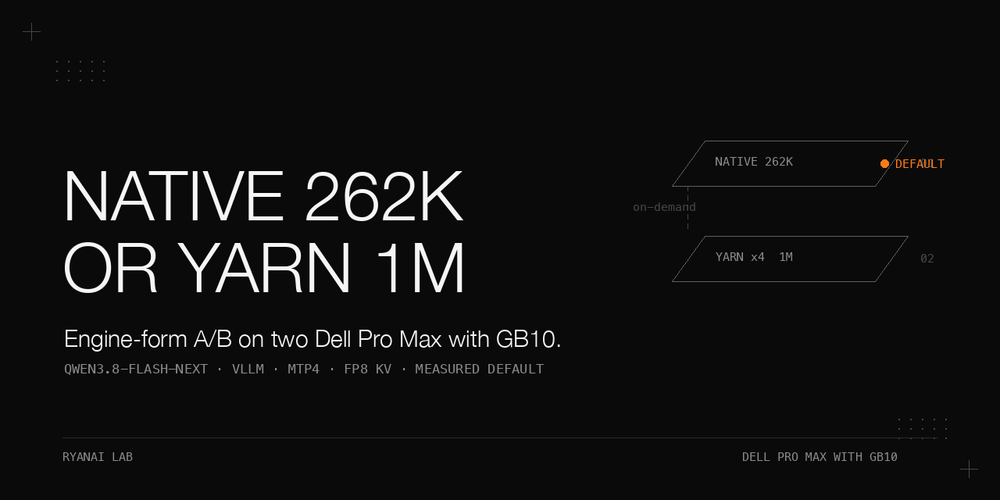

# Qwen3.8-Flash-Next engine-form A/B on two Dell Pro Max with GB10 — native 262K vs YaRN×2 vs YaRN×4 (1M) vs KV bf16 vs indexer budget vs MTP off

> A one-night engine-form A/B on two Dell Pro Max with GB10 (head node + worker node, SM12x-class GPU kernel family), running Qwen3.8-Flash-Next NVFP4 weights in vLLM inside a Docker container, scored on our private 11-category eval bank (questions not published) with thinking mode on and the sampling values listed in the stack table below. The point of this cookbook is the **decision and the evidence behind it**: which context/RoPE form, KV cache dtype, sparse-attention indexer budget, and MTP speculative-decoding setting to ship as the default engine profile, and which levers are simply unavailable on this GPU generation. Native 262K (no RoPE override) was positive or flat in the five measured categories; its lowest wall ratio was 0.62× baseline on c9-long-coding (the YaRN×2 variant's c9 wall ratio of 0.60× was lower still, so "fastest" is not claimed across all variants). No timeout was recorded in those five categories. Every number below is copied from the results tables with its measurement condition attached; the source fact sheet is not republished here, so the figures below can be checked for internal consistency but not independently traced to the source.

## Why this matters

A 1M-context YaRN×4 build booted and ran its bring-up sequence, but "boots" is not "best" — no job close to 1M input tokens was run or scored, so "end-to-end" here means the engine reached readiness, not that a 1M-token task completed. Static YaRN is observed to tax short-context quality on this bank, KV bf16 halves the token pool for no observed gain, the indexer budget lever could not start on this vLLM build (see Pitfalls), and MTP off ran ~30% slower on the c7a control for a median difference of 1.6 points. The A/B changes one variable at a time against a fixed 1M / YaRN×4 / fp8 KV / MTP4 baseline — with the caveat that two variants bundle related parameters (V1/V2 change RoPE factor and context length together; V4 changes indexer budget and compress_ratio together), so those two cannot be decomposed into per-parameter causal effects. The default profile is therefore chosen from measurements rather than from the fact that the 1M build boots. The verdict (pending owner sign-off) is to ship native 262K / fp8 KV / MTP4 as the default and keep the 1M YaRN×4 build as an on-demand profile switched in by the switch script (the 4 min switch time is a reported figure whose measurement conditions are not recorded).

## Hardware and stack

| | |
|---|---|
| Nodes | Two nodes, each a **Dell Pro Max with GB10** (head node + worker node); SM12x-class GPU kernel family |
| Model | Qwen3.8-Flash-Next, NVFP4 weights; served id `local-inference-lab/Qwen3.8-Flash-Next-NVFP4`, alias `qwen3.8-flash-next`. The weights repo, revision, weight hash, and tokenizer/config versions are not recorded in the sources, so the served id cannot be independently resolved and the NVFP4/native-context/auto-KV-dtype claims cannot be re-verified. |
| Engine | vLLM in a Docker container (exact vLLM version, Docker image digest, GPU driver, CUDA version, container start flags, and two-node parallel-launch method are not recorded in the sources), started on port 8899. The cluster recipe, recipe launcher, eval driver, and compare/switch scripts are not published in this repo; the public abstraction for the switch is `switch/stack-mode.sh` in the sibling repo dell-pro-max-gb10-vllm-stack-ab. |
| Fixed flags (all variants) | `--tool-call-parser qwen3_coder`, `--no-async-scheduling`, env `VLLM_ALLOW_LONG_MAX_MODEL_LEN=1`, `--speculative-config '{"method":"mtp","num_speculative_tokens":4,"max_model_len":<same as --max-model-len>}'` (draft-side `max_model_len` is mandatory — see Pitfalls). Exception: V5 (`nfAB-mtpoff-c7a`) passes `--speculative-config null` instead, to disable MTP; whether `null` is a valid engine-accepted way to turn MTP off was not separately verified against a pinned vLLM version. |
| YaRN overrides | `--hf-overrides` embedding `text_config.rope_parameters`: `rope_type: yarn`, `factor: 4.0` (1M) or `2.0` (512K), `rope_theta: 10000000`, `original_max_position_embeddings: 262144`, `partial_rotary_factor: 0.25`, `mrope_interleaved: true`, `mrope_section: [11, 11, 10]` |
| Baseline form | `nfB-think-full`: 1M ctx, YaRN×4, fp8 KV, indexer budget 2048 / compress_ratio 4, MTP4; logged GPU KV cache size 3.44–3.48M tokens across the 1M bring-up runs |
| Sampling (all banked runs) | `temperature 1.0, top_p 0.95, top_k 20, min_p 0.0, presence_penalty 0.0, repetition_penalty 1.0, max_tokens 16384`; chat kwargs `{"enable_thinking": true}`; eval driver runs `--parallel 4`. The main table's five categories do not pin `reasoning_effort`; only the MTP control arm and the V5 variant pin it to `xhigh`. So the c7 row of the main table (no `reasoning_effort` pinned) is a different baseline from the c7a MTP control (`xhigh` pinned) and the two must not be mixed. |

> **Note on unknowns:** the exact vLLM version and Docker image digest are not recorded in the sources, so they cannot be stated here. No internal switch-script profile names, run labels, or the comparison engine's name and scores are published here.

## How to reproduce

1. **Night before — baseline + MTP control.** Run the full thinking baseline `nfB-think-full` (11 categories × 2 runs) plus `nfB-think16-c7a` (c7-agentic-if × 3, explicit `reasoning_effort: "xhigh"`) as the MTP control arm. Sampling is fixed across all banked runs as listed in the stack table above.
2. **Run the A/B chain.** A private isolation harness (run from the eval-bank directory) waits for the baseline chain's clean END marker (15 s polls, 12 h abort), requires the baseline `results.json` to exist, and verifies the comparison engine is healthy (3 status checks, 20 s apart); it aborts otherwise. The harness itself is not published; the public abstraction it mirrors is `switch/stack-mode.sh` in the sibling repo dell-pro-max-gb10-vllm-stack-ab.
3. **Stand up five single-variable variants vs the baseline** (categories per variant: c8-judgment, c9-long-coding, c7-agentic-if, c1-kbqa, c5-extract, ×2 runs):
   - **V1 `nfAB-native`**: no rope override, `--max-model-len 262144`, spec `max_model_len 262144`.
   - **V2 `nfAB-yarn2`**: rope `factor 2.0`, `--max-model-len 524288`, spec `max_model_len 524288`.
   - **V3 `nfAB-kvbf16`**: baseline 1M/YaRN×4 plus `--kv-cache-dtype auto`; script expectation: KV pool < 2.0M tokens. The `auto` flag's resolved dtype for this checkpoint was not recorded, so "bf16" is not asserted here.
   - **V4 `nfAB-indexer`**: baseline plus `text_config` `indexer_budget: 4096`, `indexer_compress_ratio: 2` (target model only; MTP draft keeps 2048/4); adds c2-longctx.
   - **V5 `nfAB-mtpoff-c7a`**: baseline with `--speculative-config null`, c7-agentic-if × 3 with explicit xhigh (same params as the control) → 3-vs-3 MTP quality control.
4. **Per variant launch sequence.** Standby the cluster → assert the :8899 endpoint is down (skip the variant if still up after 120 s) → relaunch the engine on the head node via the cluster recipe + variant overrides → poll readiness every 30 s (900 s cap) while grepping logs for fatal patterns (`ValueError|AssertionError|died unexpectedly|Engine core initialization failed|OutOfMemory|QSA sequence length|...`) → extract and archive the engine config lines (GPU KV cache size, `kv_cache_dtype`, `max_seq_len`, `speculative_config`, indexer fields) → regex-assert the intended override actually took effect (e.g. `max_seq_len=262144`, `kv_cache_dtype=(auto|bfloat16)`, `indexer_budget.{0,4}4096`, `speculative_config=None`) or skip the variant → bank the eval runs → verify a `saved` marker plus a dated results directory before proceeding.
   - The engine is reached on port `:8899` on each node; no literal node addresses are published here.
5. **Restore the comparison engine.** Run the switch script with status verification and one retry.
6. **Emit the compare table.** A compare script emits the per-category score-Δ and wall-ratio table (`compare-ctx-2026-09-20.md`).

> The exact contents of the private isolation harness, the eval-bank questions, and the switch script internals are not published (see the fact sheet's do-not-publish list). Category names and question IDs (e.g. C7A-22) are publishable; question content is not.

## Results

Full tables with measurement conditions are in [docs/results.md](docs/results.md). Headline figures, conditions unchanged from the sheet:

**Main table.** Conditions: base = `nfB-think-full` (1M / YaRN×4 / fp8 KV / MTP4); thinking on + the sampling values listed above + `max_tokens 16384` + `qwen3_coder`; 2 runs per category; score 0–100; wall ratio = candidate ÷ baseline. The aggregation method across the 2 runs (mean vs median), the per-run scores, the seed, the per-category variance, the timeout-scoring rule, and the absolute wall-clock seconds are not recorded in the sources, so the table can only be checked for arithmetic consistency, not for effect size or significance. "—" = variant never started (see [What did not work](#what-did-not-work)).

| category | base | nfAB-native (262K) | nfAB-yarn2 (512K) | nfAB-kvbf16 (1M) | nfAB-indexer (4096/2) |
|---|---|---|---|---|---|
| c1-kbqa | 88.3 | 93.3 (+5.0) 0.98× | 85.0 (−3.3) 0.91× | 83.3 (−5.0) 0.91× | — |
| c5-extract | 84.2 | 86.0 (+1.8) 1.31× | 84.4 (+0.2) 0.84× | 83.0 (−1.2) 0.89× | — |
| c7-agentic-if | 91.7 | 92.5 (+0.8) 1.02× | 94.2 (+2.5) 0.99× | 90.8 (−0.9) 1.09× | — |
| c8-judgment | 98.3 | 98.3 (+0.0) 1.05× | 93.3 (−5.0) 0.96× | 96.7 (−1.6) 0.95× | — |
| c9-long-coding | 100.0 | 100.0 (+0.0) 0.62× | 98.3 (−1.7) 0.60× | 100.0 (+0.0) 0.98× | — |

**MTP control.** Conditions: c7-agentic-if × 3, both arms same explicit-xhigh params; MTP4 arm = `nfB-think16-c7a`, MTP-off arm = `nfAB-mtpoff-c7a`.

| arm | three scores | median | wall clock |
|---|---|---|---|
| MTP4 (baseline) | 88.3, 91.7, 91.7 | 91.7 | — |
| MTP off | 95.0, 93.3, 93.3 | 93.3 | ~30% slower |

**KV pool.** Conditions: engine config line `GPU KV cache size`, 1M fp8 baseline = 3.44–3.48M tokens across the bring-up runs; KV bf16 variant = 3.45M→1.86M tokens. fp8 vs bf16 quality: no fp8 score decrease was observed across the five listed categories (the official recipe does not use fp8 KV, so there is no same-recipe fp8-vs-non-fp8 control here; "no fp8 loss" is a bounded observation over these five categories, not a proof of losslessness).

## What did not work

- **Indexer budget 4096 / compress_ratio 2**: engine fails to start with `SM12x QSA integration requires compress_ratio=4` — a GB10 (SM12x) kernel limitation; the community-forum (#260) lever is simply unavailable on this hardware. No scores produced.
- **YaRN 2 @ 512K**: one source labels it "no gain", citing c1 −3.3 and c8 −5.0; the compare table records two positive Δs in this column — c5-extract +0.2 and c7a +2.5 — so it is not the single positive the "only positive" wording implied. Both figures are reported in the sources; the sources characterize this variant differently.
- **KV bf16 @ 1M**: Δ ≤ 0 in all five categories and KV pool 3.45M→1.86M. One source calls it "slower" without specifying which time statistic; the measured per-category wall ratios (candidate ÷ baseline) are mostly below 1.0 (0.89–1.09×, i.e. candidate was faster or roughly even in four of five categories), so "slower" does not agree with the wall-ratio column and is left uninterpreted here.
- **MTP off**: the c7a median moved from 91.7 to 93.3, a 1.6-point difference over 3 runs (question count and per-question score granularity are not recorded, so "1 question of noise" cannot be verified — only the 1.6-point median difference is shown), at ~30% wall cost → MTP4 retained.
- **Source discrepancy, kept as-is**: one source states the official card's "static YaRN hurts short text" check as "c1 −5, c9 38% slower", while the compare table gives native's c9 wall ratio as 0.62× (candidate ÷ baseline, i.e. native used 62% of the baseline's time — native was ~38% faster, or equivalently the baseline was ~61% slower). "c9 38% slower" therefore matches the wall-ratio table only if "slower" refers to the baseline (native's c9 score was unchanged at 100.0), not to native; the two statements do not obviously agree and neither is adjusted here.

## Pitfalls

Symptom → root cause → fix, in the order they matter. Expanded in [docs/pitfalls.md](docs/pitfalls.md).

1. **`QSA sequence length 1000000 exceeds the configured limit 262144` at startup with MTP** → this vLLM build appears to build the MTP draft's model config from `speculative_config.max_model_len` (default `None`) and to not pass the dict `hf_overrides` to the draft side (the relevant code path in `mtp.py` was not matched to a pinned vLLM version, so this is an inference from the symptom, not a code-verified root cause) → set `max_model_len` inside the `--speculative-config` JSON, matching the main context length.
2. **Runaway agent loops and 3–5× wall clocks on agentic categories** → suspected vLLM async scheduling × MTP host/device race, with accepted-token counts appearing to leak across requests; community issues #53912 and #51571 show the same symptom shape, but the exact vLLM version, the matching code path, and a controlled reproduction are not recorded here, so this is a working hypothesis, not a confirmed root cause. This build auto-enables async scheduling when MTP is on. → pass `--no-async-scheduling` (all A/B variants include it).
3. **KV bf16 halves the token pool** → bf16 KV costs double the bytes per token (3.45M→1.86M) for zero observed quality gain here → keep fp8 KV (no fp8 score decrease was observed across the five listed categories vs the official non-fp8 recipe; there is no same-recipe fp8-vs-non-fp8 control, so this is a bounded observation, not a proof of losslessness).
4. **Static YaRN taxes short-context quality** → observed on this bank (native wins c1 +5.0 vs the YaRN×4 baseline) → default to native 262K and escalate to 1M only when a job needs it. No input-length sweep and no max_model_len-only control were run, so the observed short-context difference is attributed to the YaRN×4 form by the experiment design, not isolated as the sole causal variable.
5. **"Override silently not applied" contaminating an A/B** → launch helper asserts the vLLM config lines (`max_seq_len`, `kv_cache_dtype`, `indexer_budget`, `speculative_config=None`) post-boot and skips the variant on mismatch → copy this assert-then-bank pattern in any harness.
6. **SM12x QSA indexer knob locked** → `compress_ratio` must stay 4 on this vLLM build regardless of `indexer_budget` → budget 4096 / ratio 2 is dead on this platform. This vLLM build's kernel raises `SM12x QSA integration requires compress_ratio=4`; budget 4096/ratio 4 and other ratios were not tested, and other vLLM builds were not tested, so the lock is scoped to this build, not asserted for the whole GPU generation.

## Decision

Verdict (as recommended in the sources, pending owner sign-off):

- **Default tier: native 262K.** Ship the default profile — native 262K (no RoPE override), fp8 KV, MTP4, `--no-async-scheduling`, `--tool-call-parser qwen3_coder`. The default engine exposes a fast tier and a quality tier; their thinking-effort assignments are not recorded in the sources, so no thinking-tier recommendation is made here. Native 262K was positive or flat in the five measured categories (c1 +5.0, c5 +1.8, c7a +0.8, c8 +0.0, c9 +0.0); its lowest wall ratio was 0.62× baseline on c9-long-coding (the YaRN×2 variant's c9 wall ratio of 0.60× was lower, so "fastest" is not claimed across all variants). No timeout was recorded in those five categories (timeout config, request count, and failure/retry counts are not recorded).
- **On-demand tier: 1M YaRN.** Keep the on-demand profile (1M ctx, YaRN×4), switched in via the switch script (the 4 min switch time is a reported figure whose measurement conditions are not recorded). Escalate to 1M only when a job actually needs the long context; static YaRN taxes short-context quality (native wins c1 +5.0 vs the YaRN×4 baseline).
- **fp8 KV: kept.** KV bf16 halved the token pool (3.45M→1.86M) with no observed quality gain (Δ ≤ 0 in all five categories); no fp8 score decrease was observed across the five listed categories vs the official non-fp8 recipe (bounded observation, not a losslessness proof).
- **MTP-4: kept.** MTP off moved the c7a median from 91.7 to 93.3 (a 1.6-point difference over 3 runs; per-question granularity is not recorded, so "1 question of noise" is not verifiable) while running ~30% slower; MTP4 retained.
- **Indexer ratio lever: unavailable on this vLLM build.** The indexer budget 4096 / compress_ratio 2 variant could not start because this vLLM build's kernel raises the error below. The exact engine failure text is:

  > `SM12x QSA integration requires compress_ratio=4`

  This is a kernel limitation of this vLLM build on GB10 (SM12x); budget 4096/ratio 4 and other ratios were not tested, and other vLLM builds were not tested, so the lock is scoped to this build, not asserted for the whole GPU generation. `compress_ratio` must stay 4 on this build regardless of `indexer_budget`.

## Files

- `README.md` — this cookbook.
- `docs/results.md` — all results tables from the sheet, complete, with measurement conditions.
- `docs/pitfalls.md` — the pitfalls expanded (symptom / root cause / fix / how we found it).
- `docs/make_banner.py` — banner generator (pure PIL); writes `docs/assets/banner.png`.
- `docs/assets/banner.png` — banner image (generate by running `python3 docs/make_banner.py`; the script requires Pillow — install with `pip install Pillow`; not committed pre-rendered here).

> Files not published: the eval-bank question texts and per-question transcripts, raw engine/container logs and per-run bank logs, internal filesystem paths and switch-script state strings, the comparison engine's name and scores, the internal ADR/goal-chain documents, and per-question breakdown files.

## License

Apache-2.0.
